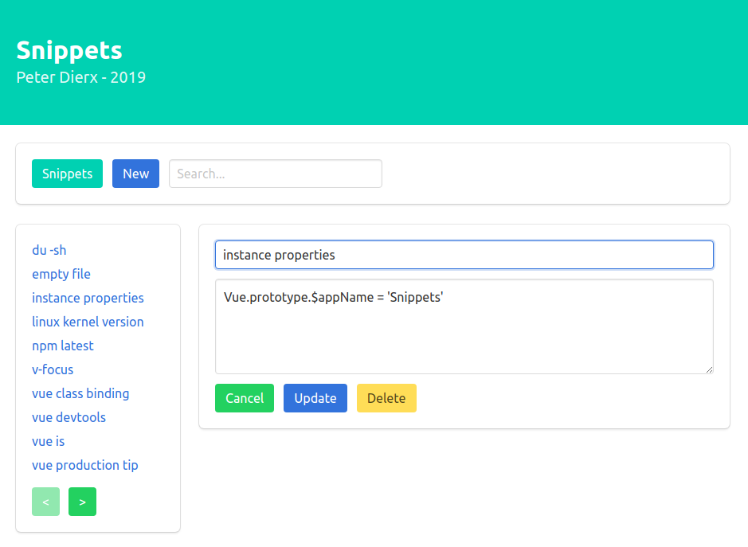

# Snippets

<p align='center'></p>

### Setup
```
> yarn install
```

### Snippets API
```
> cd snippets/api
> node api
Connected to SQLite Database snippets...
Server listening at http://localhost:4567
```

### Snippets Vue
```
New terminal window
> cd snippets
> yarn serve
App running at:
- Local: http://localhost:8080/
```
